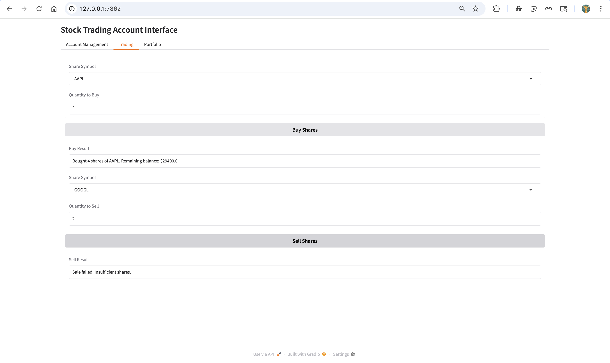
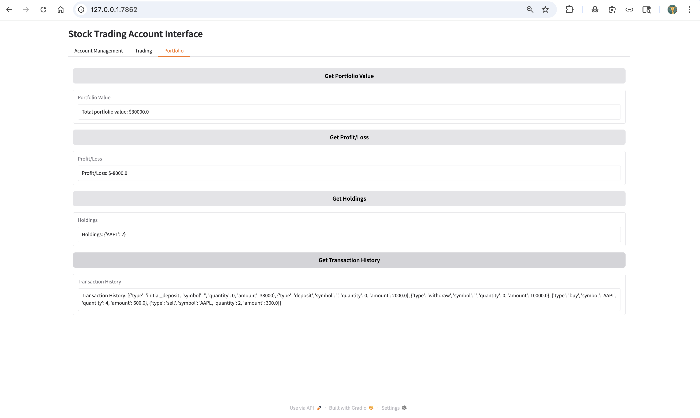
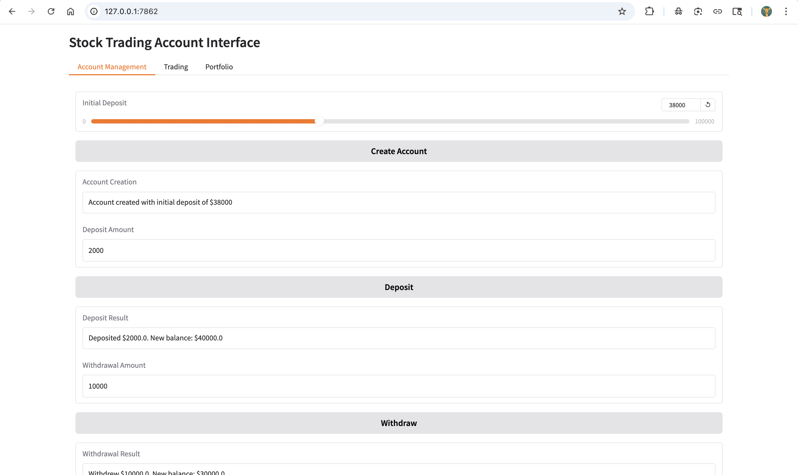

# Autonomous Traders MCP (Market Control Platform)

A sophisticated trading platform that enables autonomous trading strategies with real-time market data integration and portfolio management capabilities.



## Features

### Portfolio Management
- Real-time portfolio tracking and valuation
- Automated trade execution
- Performance analytics and reporting
- Multiple trading strategies support



### Account Management
- Secure account handling
- Transaction history
- Balance tracking
- Strategy customization



### Trading Tools
- Real-time market data integration
- Automated trading strategies
- Risk management tools
- Performance diagnostics


## Getting Started

### Prerequisites
- Python 3.8+
- SQLite3
- Required Python packages (see pyproject.toml)

### Installation

1. Clone the repository:
```bash
git clone https://github.com/yourusername/autonomous_traders_mcp.git
cd autonomous_traders_mcp
```

2. Create and activate a virtual environment:
```bash
python -m venv .venv
source .venv/bin/activate  # On Windows: .venv\Scripts\activate
```

3. Install dependencies:
```bash
pip install -r requirements.txt
```

### Running the Application

1. Start the market server:
```bash
python market_server.py
```

2. Start the accounts server:
```bash
python accounts_server.py
```

3. Run the main application:
```bash
python main.py
```

## Project Structure

- `accounts.py` - Account management and transaction handling
- `market.py` - Market data integration and price feeds
- `traders.py` - Trading strategy implementations
- `database.py` - Database operations and persistence
- `diagnostics.py` - Performance monitoring and analytics
- `templates.py` - Strategy templates and configurations

## Features in Detail

### Account Management
- Create and manage multiple trading accounts
- Track portfolio value in real-time
- View transaction history
- Monitor profit/loss metrics

### Trading Capabilities
- Execute trades with automated strategies
- Real-time market data integration
- Risk management tools
- Performance analytics

### Strategy Implementation
- Custom strategy development
- Backtesting capabilities
- Performance monitoring
- Risk assessment

## Contributing

Contributions are welcome! Please feel free to submit a Pull Request.

## License

This project is licensed under the MIT License - see the LICENSE file for details.

## Acknowledgments

- Special thanks to the open-source community for their invaluable tools and libraries


